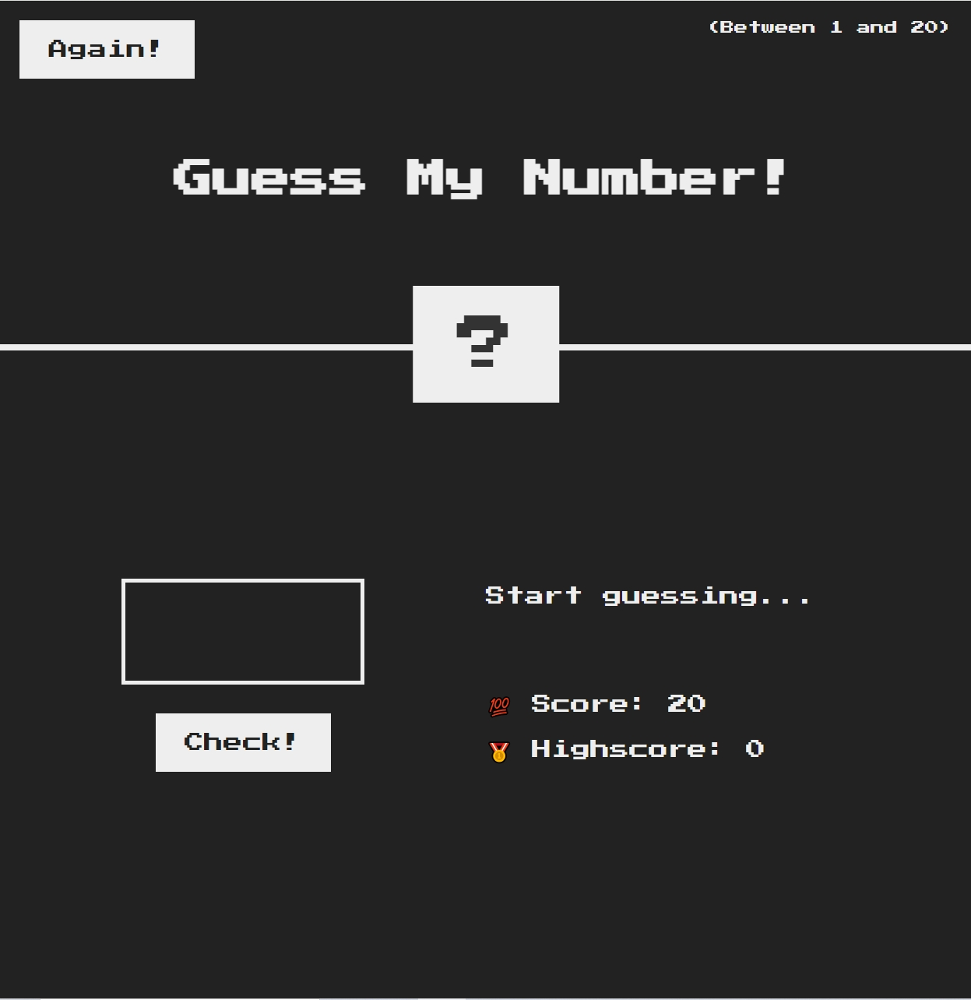
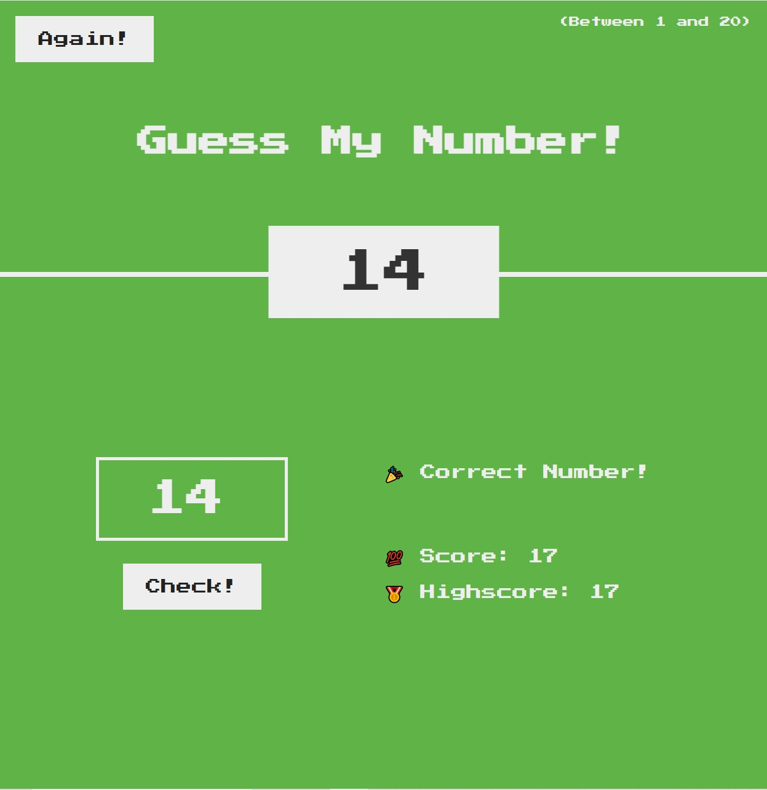

# Number-Guessing-Game

## Description

The Number-Guessing-Game is a simple interactive game where the player aims to guess a randomly generated number between 1 and 20. The game provides feedback on each guess, indicating whether the guess is too high or too low. The player's score starts at 20 and decreases by 1 with each incorrect guess. The game tracks the player's highest score achieved across all sessions.

## How to Play

1. Enter a number between 1 and 20 in the input box.
2. Click the "Check!" button to submit your guess.
3. If your guess is correct, you win the game.
4. If your guess is incorrect, a message will indicate whether the guess is too high or too low. Adjust your guess based on the feedback.
5. Each incorrect guess reduces the score by 1 point.
6. If your score reaches 0, you lose the game.
7. Your highest score is saved and displayed as "Highscore".
8. Click the "Again!" button to restart the game at any time.

## Interface

The game interface includes:

- An input box to enter your guess.
- A "Check!" button to submit your guess.
- Feedback messages to guide your next guess.
- Score and Highscore display.
- An "Again!" button to restart the game.

## Screenshot

Enjoy playing and see how quickly you can guess the correct number!

## Project URL
Try this game online :) [Number-Guessing-Game](https://icy-guo.github.io/Number-Guessing-Game/
